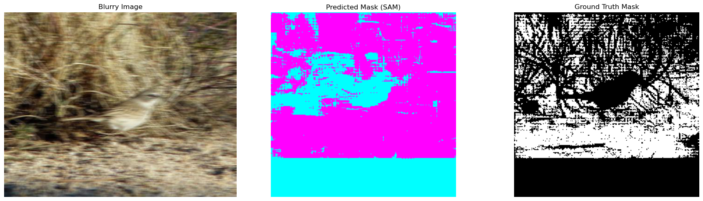

**Improving Segementation with Super Resolution**

**Author:- Paras Jain**

A current Masters student in RIT in the field of Artificial Intelligence

**Course** Capstone

**Introduction :-**

In this project I intend to enhance segementation for blurry images and also for animal which get camouflaged easily with their sourroundings making it tough for SAM models to segment them with their background.

**Pipeline**
Dataset - inaturalist dataset

**Model Setup**

The model is setup with an SR model as a wrapper class over the SAM model. This will enhance the image before it get input to the model. 

For Now the SR models which are being used is 

EDSR_x4
Deblur model is used using OPENCV libaray

More SR models(diffusion based) and pre-trained Deblur model will be used for experiment. 

Metrices

Dice Score 
IOU score

**Baseline Figures**

Segmentation Using Tiny SAM

Segmentation using SAM-Vit

**Results**

Setup Instructions

git clone https://github.com/yourusername/sam-enhancement.git

cd sam-enhancement

!pip install -r requirements.txt

The Dataset can be downloaded from HuggingFace

from datasets import load_dataset

ds = load_dataset("sxj1215/inaturalist")

**Acknowledgment **

This project would not have been possible without the contributions of the open-source community. We gratefully acknowledge the following:

	•	Meta AI Research for developing the Segment Anything Model (SAM), a foundation for segmentation tasks.
 
	•	Niels Rogge and Hugging Face for providing SLIM-SAM, an efficient lightweight version of SAM used as a baseline.
 
	•	Hugging Face Datasets for hosting the iNaturalist dataset used in this study.
 
	•	OpenCV and contributors for implementing the DNN Super-Resolution module used to enhance image resolution via the EDSR model.
